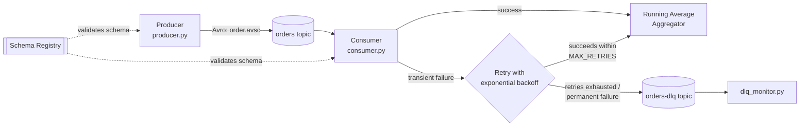

# Kafka Order Processing System

A Kafka-based pipeline that produces and consumes Avro-serialized order
messages, with real-time running-average aggregation, retry logic for
transient failures, and a Dead Letter Queue (DLQ) for permanently failed
messages.

## Architecture



**Flow summary**
1. `producer.py` generates random order events (`orderId`, `product`, `price`) and publishes them, Avro-encoded, to the `orders` topic.
2. `consumer.py` reads from `orders`, and for each message:
   - Attempts to process it (in this assignment, "processing" = updating the running average; a real system would also write to a DB / call an API here).
   - If a **transient** error occurs (simulated flaky downstream), it retries up to `MAX_RETRIES` times with **exponential backoff** (1s → 2s → 4s ...).
   - If a **permanent** error occurs, or retries are exhausted, the message is wrapped with error metadata and sent to `orders-dlq`.
   - Only commits the Kafka offset once the message is either processed successfully or safely routed to the DLQ — nothing is silently dropped.
3. `dlq_monitor.py` tails the DLQ topic so failed messages can be inspected live.

## Repository layout

```
kafka-order-system/
├── docker-compose.yml       # Kafka + Zookeeper + Schema Registry + Kafka UI
├── requirements.txt
├── config.py                # shared config (topics, retry policy, failure rates)
├── schemas/
│   ├── order.avsc           # schema for the 'orders' topic
│   └── order_dlq.avsc       # schema for the 'orders-dlq' topic
├── producer.py
├── consumer.py
├── dlq_monitor.py
└── README.md
```

## Prerequisites

- Docker & Docker Compose
- Python 3.9+

## Setup

```bash
# 1. Clone your repo and cd into it
git clone <your-repo-url>
cd kafka-order-system

# 2. Start Kafka, Zookeeper, Schema Registry, and Kafka UI
docker compose up -d

# 3. Install Python dependencies (a virtualenv is recommended)
python3 -m venv venv
source venv/bin/activate        # Windows: venv\Scripts\activate
pip install -r requirements.txt
```

Kafka UI will be available at **http://localhost:8080** — useful for showing
topics, messages, and consumer group lag during your live demo.

## Running the demo

Open three terminals:

**Terminal 1 — start the consumer (aggregation + retry + DLQ logic):**
```bash
python consumer.py
```

**Terminal 2 — watch the DLQ:**
```bash
python dlq_monitor.py
```

**Terminal 3 — start producing orders:**
```bash
python producer.py --count 100 --interval 0.3
# or run indefinitely for a longer live demo:
python producer.py --forever --interval 0.5
```

You should see, in Terminal 1:
- Periodic aggregation snapshots (running average per product and overall).
- `WARNING` logs when a transient failure is simulated and retried.
- `ERROR` logs + a DLQ send when retries are exhausted or a permanent failure occurs.

And in Terminal 2, the corresponding dead-lettered messages with full error metadata.

## Design decisions worth mentioning to your marker

- **Why Avro + Schema Registry?** Enforces a contract between producer and
  consumer, supports schema evolution, and is more compact on the wire than JSON.
- **Why exponential backoff?** Avoids hammering a struggling downstream
  dependency; the retry delay grows (`INITIAL_BACKOFF_SECONDS * BACKOFF_MULTIPLIER^attempt`)
  so transient issues get more time to resolve.
- **Why distinguish transient vs. permanent errors?** Retrying a permanent
  error (e.g. malformed data) wastes time and delays the rest of the
  partition; it should go straight to the DLQ. Retrying a transient error a
  few times often self-heals.
- **Why commit offsets manually, only after DLQ/success?** Prevents
  "acknowledged but lost" messages — a message is only marked consumed once
  it has been durably handled one way or the other.
- **Why an O(1) running average?** Storing every price and recomputing the
  mean would grow unbounded; the aggregator keeps only a running `count`
  and `sum` per key.

## Tuning failure simulation

`config.py` exposes `TRANSIENT_FAILURE_PROBABILITY` and
`PERMANENT_FAILURE_PROBABILITY` purely so you can demonstrate retry/DLQ
behaviour live without needing a genuinely flaky external service. Set both
to `0` to see the "happy path" only, or raise them to force more DLQ
traffic for the demo.

## Git submission checklist

- [ ] All source files committed (`producer.py`, `consumer.py`, `dlq_monitor.py`, `config.py`, `schemas/`, `docker-compose.yml`, `requirements.txt`, `README.md`)
- [ ] `.gitignore` excludes `venv/` and `__pycache__/`
- [ ] Commit history shows incremental development (not one giant commit)
- [ ] README updated with any changes you make while implementing/extending this

## Possible extensions (if you want to go further)

- Add unit tests for `RunningAverageAggregator` and the retry logic (mock `process_order` to raise controlled exceptions).
- Add a `dlq_reprocessor.py` that reads from `orders-dlq` and republishes to `orders` after manual review.
- Persist aggregation state to a compacted Kafka topic so it survives consumer restarts.
- Replace the simulated failures with a real dependency (e.g. write aggregates to Postgres/Redis) so transient failures are genuine (e.g. connection pool exhaustion).
